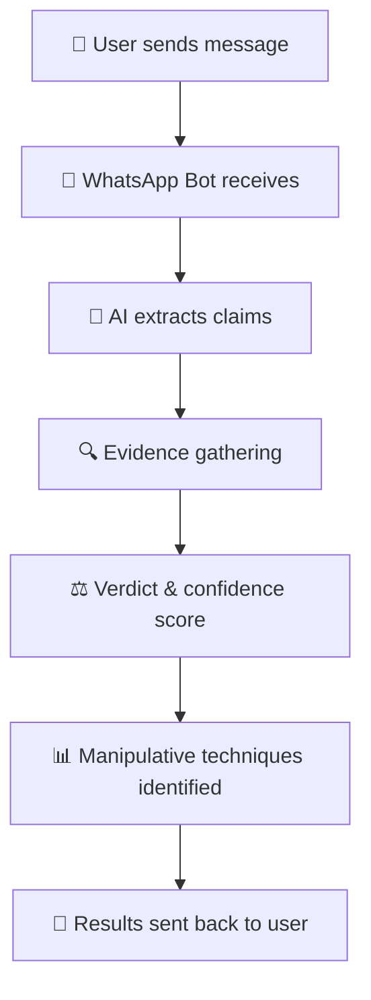

<div align="center">
  <h1 style="font-size: 3.5em; font-weight: 900; line-height: 1.2; margin: 20px 0;">
    <span style="background: linear-gradient(90deg, #25D366, #128C7E, #075E54); -webkit-background-clip: text; -webkit-text-fill-color: transparent; display: inline-block;">
      SatyaShield WhatsApp Bot
    </span>
  </h1>
</div>


<div align="center">
  
  **Combat Misinformation Instantly on WhatsApp**
  
  [](https://wa.me/15551482620)   [](https://developers.facebook.com/docs/whatsapp)
  [](https://expressjs.com/)   [](https://cloud.google.com/)
  
  *Turn your WhatsApp into a misinformation detection powerhouse*

</div>

---

## 🚀 **Try It Now!**

**📱 WhatsApp Number: [+1 (555) 148-2620](https://wa.me/15551482620)**

Simply send any suspicious text, forward a message, or share an image to get instant fact-checking results!

---

## 📱 **How It Works**

<div align="center">



</div>

### **Step-by-Step Process:**

1. **📨 Send Your Query** - Forward suspicious messages, send text, or share images
2. **🤖 Instant Processing** - Our AI agent extracts verifiable claims
3. **🔍 Evidence Collection** - Parallel gathering of credible sources
4. **⚖️ Smart Analysis** - AI evaluates credibility with confidence scores
5. **📊 Educational Response** - Detailed breakdown of manipulative techniques
6. **📱 Get Results** - Comprehensive fact-check delivered instantly

---

## ✨ **Key Features**
<div align="center">

<table>
<tr>
<td width="50%">

### 🎯 **Instant Verification**
- Real-time fact-checking on WhatsApp
- Support for text and image analysis
- No app installation required

### 🧠 **AI-Powered Intelligence**
- Advanced claim extraction
- Parallel evidence gathering
- Manipulative technique detection

</td>
<td width="50%">

### 📊 **Educational Insights**
- Confidence scoring system
- Detailed reasoning explanations
- Misinformation pattern recognition

### 🌐 **Seamless Integration**
- Direct WhatsApp interaction
- Cross-platform compatibility
- 24/7 availability

</td>
</tr>
</table>
</div>

---

## 📸 **Screenshots & Demo**

<div align="center">

### **💬 Chat Interface**
*Clean, intuitive WhatsApp interaction*


### **📊 Analysis Results**
*Comprehensive fact-checking with confidence scores*


### **🚨 Misinformation Detection**
*Detailed breakdown of manipulative techniques*


</div>

---

## 🛠️ **Tech Stack**

<div align="center">

| Technology | Purpose | Version |
|------------|---------|---------|
|  | Runtime Environment | 18+ |
|  | Web Framework | 4.x |
|  | Messaging Platform | Cloud API |
|  | AI Services | Latest |

</div>

### **Core Dependencies**
```json
{
  "express": "^5.1.0",
  "axios": "^1.11.0",
  "dotenv": "^17.2.1",
  "mime-types": "^3.0.1"

}
```

---

## ⚡ **Quick Start**

### **Prerequisites**
- Node.js 18+ installed
- WhatsApp Business API access
- Google Cloud credentials
- Environment variables configured

### **Installation**

```bash
# Clone the repository
git clone https://github.com/Satya-Shield/Whatsapp-Bot.git
cd Whatsapp-Bot

# Install dependencies
npm install

# Set up environment variables
cp .env.example .env
# Edit .env with your configuration

# Build the API
npm run build

# Start the server
npm start
```

### **Environment Variables**
```env
PORT=3000
WHATSAPP_VERIFY_TOKEN=your-verify-token
WHATSAPP_API_VERSION=v22.0
WHATSAPP_PHONE_NUMBER_ID=your-business-whatsapp-phone-number-id
WHATSAPP_ACCESS_TOKEN=your-whatsapp-token
```

---

## 🌟 **Why SatyaShield WhatsApp Bot?**

<div align="center">

| **🚀 Advantage** | **📊 Impact** |
|------------------|---------------|
| **Instant Access** | No app downloads needed - works directly in WhatsApp |
| **Mass Reach** | 400M+ WhatsApp users in India can access instantly |
| **Educational** | Not just verification - explains *why* content is misleading |
| **Multilingual** | Supports regional languages for broader accessibility |
| **Always Available** | 24/7 fact-checking service |

</div>

---

## 🔗 **SatyaShield Ecosystem**

<div align="center">

**Explore our complete misinformation-fighting toolkit:**

[](https://github.com/Satya-Shield/Frontend)
[](https://github.com/Satya-Shield/Browser-Extension)
[](https://github.com/Satya-Shield/Backend)

</div>

---

## 📞 **Get Started**

<div align="center">

### **📱 Send a message to get started:**
## [+1 (555) 148-2620](https://wa.me/15551482620)

*Try sending: "Is this news true?" along with any suspicious content*

</div>

---

## 🤝 **Contributing**

We welcome contributions! Please check our [Contributing Guidelines](CONTRIBUTING.md) and feel free to submit issues or pull requests.

### **Development Setup**
```bash
# Fork the repository
# Clone your fork
git clone https://github.com/YOUR_USERNAME/Whatsapp-Bot.git

# Create a feature branch
git checkout -b feature/your-feature-name

# Make your changes and commit
git commit -m "Add your amazing feature"

# Push and create a pull request
git push origin feature/your-feature-name
```

---

## 📄 **License**

This project is licensed under the MIT License - see the [LICENSE](LICENSE) file for details.

---

## 🙏 **Acknowledgments**

- **Meta** for WhatsApp Cloud API
- **Google Cloud** for AI services
- **Open-source community** for incredible tools
- **Contributors** who make this project possible

---

<div align="center">

**💡 Built with ❤️ for a misinformation-free digital India**

[⭐ Star this repo](https://github.com/Satya-Shield/WhatsApp-chatbot) | [🐛 Report Bug](https://github.com/Satya-Shield/WhatsApp-chatbot/issues) | [✨ Request Feature](https://github.com/Satya-Shield/WhatsApp-chatbot/issues/new)

---

*Part of the SatyaShield ecosystem - Empowering digital literacy through AI*

</div>